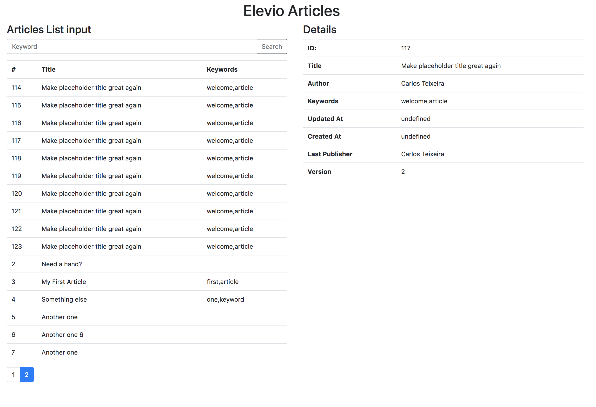
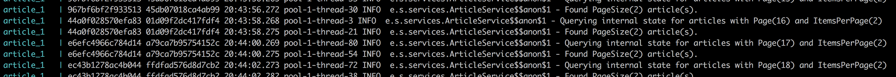
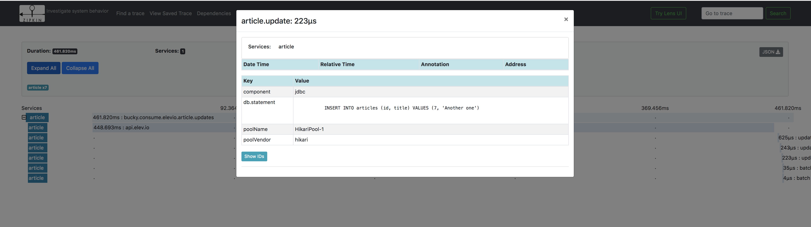
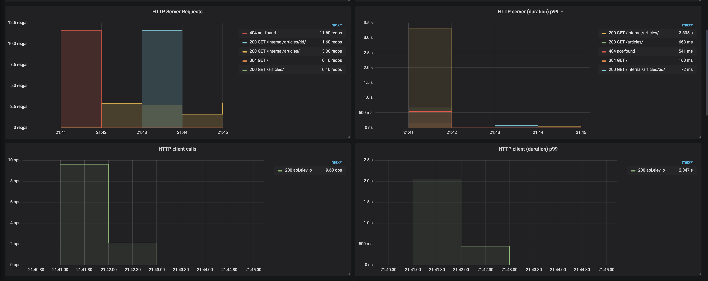

#### Getting Started
- Install [docker](https://docs.docker.com/install/) and [docker-compose](https://docs.docker.com/compose/install/)
- Add the Elevio Token and service API's to `docker-compose.yml` both for the article and for the updater services (notice that the Bearer part has to be included). 
```yaml
 article:
    ...
    environment:
      ELEVIO_TOKEN: "Bearer a_token"
      ELEVIO_API_KEY: "an_api_key"
  updater:
    ...
    environment:
      ELEVIO_TOKEN: "Bearer a_token"
      ELEVIO_API_KEY: "an_api_key"
```
- Run `docker-compose build` (unfortunately this may take 
a while as the dependencies have to be fetched and both projects 
are build independently; it usually takes less than 10 minutes)
- Run `docker-compose up -d` (due to concurrency issues, it may happen that the services are 
started before rabbit and postgres are ready to accept connections)
- Check if the article service is up by running `curl -v http://127.0.0.1:9000/_meta/health` ; 
if the reponse is 200 then the service should be up, if not; 
running `docker-compose up -d` again should start the service and fix the issue
- Perform the same check for the article updater service by running `curl -v http://127.0.0.1:9001/_meta/health` ; 
If the service is not up, running `docker-compose up -d` should fix it as well
- Go to `localhost:9000` !!!


#### Paginated View

The paginated view offers a way to visualize all the articles in your Elevio account.
On the left, you can see the list of items; clicking on of those items will show you its details on the right.

Typing a **keyword** on the input box and then clicking search,  will filter the paginated list by keyword. Notice that, when filtered
by keyword, this list of results may not be up to date (check Article Updater for details).



#### Article Service
The article service is exposed on port 9000.  

| Endpoint  | Description |
| ------------- | ------------- |
| /articles/:id  | Fetches the most up to date details for article :id. |
| /articles?page=1&keyword=k1&keyword=k2  | Lists articles. Page is mandatory. |
| /internal/articles/:id  | Fetches the stored values for article :id. |
| /internal/articles?page=1&itemsPerPage=10  | Fetches the paginated stored list of values. Both `page` and `itemsPerPage` are mandatory |

 
#### Article Updater
 
In order to avoid going over the api limits of 10 requests per second and support searching by keyword in a paginated manner, 
the Article Service stores a list of articles and their keywords. 

This "cache" of values is bound to go stale if not refreshed periodically so the article updater(a separate service)
continually searches and compares the elevio and article service state. 
When a difference is found, it publishes an event into rabbit which will get picked up/consumed by the article service.
The speed/rate at which this service runs can be configured using the Updater `application.conf`

```.hocon
internal-walker {
  parallelization: 10
  items-per-page: 2
  rate: 1 second
}

elevio-walker {
  parallelization: 10
  rate: 1 second
}
```

#### Logging
Correlation id's are being printed with the log calls which can be used to group logs generated
within the same call/transaction.
In order to check the logs printed by the service you can run:
`docker-compose logs -f article`


Note: Unfortunately it seems like Kamon does not fully support fs2 which is why the `updater` service
does not generate/log this correlation id.

#### Zipkin 
Zipkin can be viewed on port 9411.



#### Grafana
Grafana is running on port 3000.
 
 
Note: In order to make grafana dashboards available, a volume `docker/data/grafana` is mounted in the 
container.
There are two dashboards , one for the Updater and another for the Actual Service


#### Possible Improvements

- Add throttle mechanism to the Article service; even thought throttling exists on the updater side, if a long batch of article updates
events accumulates in rabbit, then it's likely that the Article service will go over the api rate limit.
- Fix issue between fs2 / kamon . (Newer version of Kamon is likely to address the issue).
- Improve UI

#### Tools & Libraries used
- cats
- cats-effect 
- http4s (HTTP server & client)
- circe (JSON encoding/decoding)
- Kamon (Tracing & Metric collection)
- Doobie (Database Read/Write)
- Flyway (Database Migrations)
- Bucky (RabbitMQ Library)
- Docker/Docker-compose (orchestration)
- Grafana (Dashboards)
- InfluxDB (Time series storage)
- RabbitMQ 
- Postgres (Database)
- Zipking (Trace visualization & Storage)
